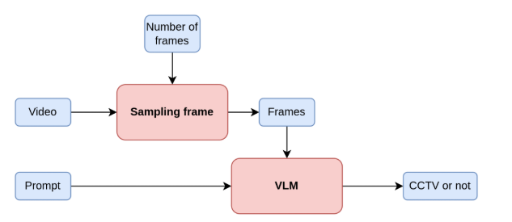
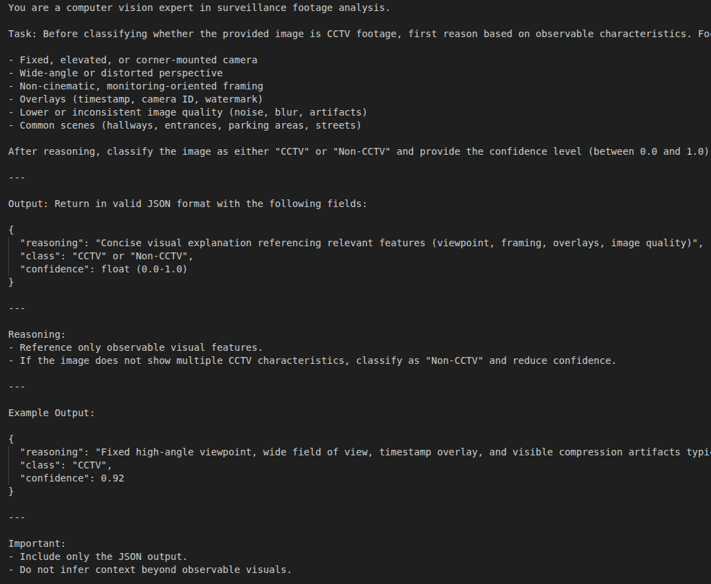
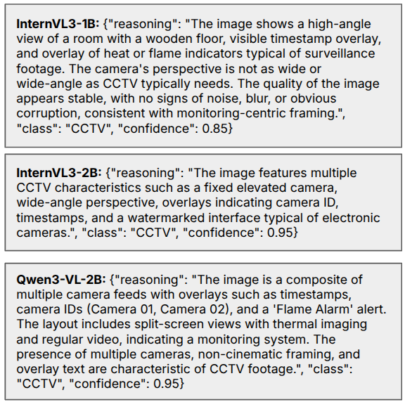

# Automatic CCTV Video Dataset Construction

## Description

This project provides an end-to-end pipeline for automatically collecting, filtering, and refining CCTV video datasets. The system consists of three modules, including a downloader module that searches and downloads videos from internet, a filtering module that classifies videos as CCTV or non-CCTV footage, and a refinement module that performs additional quality control on the filtered dataset to ensure high-quality surveillance video collections for computer vision research.

## Demo Samples

### Pipeline



### Prompt Example



### Output Example



## Installation

Create and activate a new conda environment:

```bash
# Create environment with Python 3.10+
conda create -n piaspace python=3.10
conda activate piaspace

# Install PyTorch with CUDA support (adjust CUDA version as needed)
conda install pytorch torchvision pytorch-cuda=12.4 -c pytorch -c nvidia

# Install all project dependencies
pip install -r requirements/all.txt

# For filtering module with flash attention (optional, for better performance):
pip install --extra-index-url https://miropsota.github.io/torch_packages_builder flash_attn==2.8.3+pt2.6.0cu124
```

For OpenAI-powered search query generation, set your API key:

```bash
export OPENAI_API_KEY='your-api-key-here'
```

## How to Use

Before running any module, adjust the hyperparameters in the configuration files located in `assets/cfg/` to match your requirements (see [Configuration & Hyperparameters](#configuration--hyperparameters) section below).

### Complete Pipeline

Run all three modules sequentially:

```bash
bash scripts/all.sh
```

This executes the downloader, filtering, and refinement modules in order using their respective configuration files.

### Module 1: Downloader

Search and download videos from various sources:

```bash
# Using configuration file (recommended)
bash scripts/run_downloader.sh
```

### Module 2: Filtering

Classify videos as CCTV or non-CCTV using VLMs:

```bash
# Using configuration file
bash scripts/filtering_module.sh
```

The filtering module processes videos through InternVL or Qwen-VL models, extracts frames, and outputs classification results with confidence scores and reasoning.

### Module 3: Refinement

Perform additional quality control using VQA:

```bash
# Using configuration file
bash scripts/refinement_module.sh
```

## Configuration & Hyperparameters

All modules are configured via YAML files in `assets/cfg/`. Edit these files before running to customize the pipeline for your use case. Command-line arguments override configuration file values.

### Downloader Module (`assets/cfg/downloader_module/config.yaml`)

  - `use_llm` (bool): Use LLM to automatically generate search queries. Set to `false` to use manual queries.
  - `llm.backend` (str): LLM backend - `openai` or `qwen`
  - `llm.model` (str): Model name or path (e.g., `gpt-4o-mini` or `Qwen/Qwen2.5-1.5B-Instruct`)
  - `search_queries` (list): Manual search queries when `use_llm` is false (e.g., `["cctv fire video"]`)
  - `search_queries_file` (str): Path to file with search queries (one per line)
  - `search_queries_per_class` (int): Number of queries to generate per class when using LLM (default: 5)
  - `data_source` (str): Video search source - `youtube`, `google`, `ddgs`, or `browser_use`
  - `search.videos_per_keyword` (int): Number of videos to download per search query (default: 10)
  - `search.max_results` (int): Maximum results per query (overrides videos_per_keyword if set)
  - `download.output_dir` (str): Output directory for downloaded videos
  - `class_name` (list): List of anomaly classes to collect (e.g., `["Fire", "Violence", "Smoke"]`)

### Filtering Module (`assets/cfg/filtering_module/config4.yaml`)

  - `model_type` (str): Which VLM(s) to use - `internvl`, `qwenvl`, or `both`
  - `models` (list): List of models with `name`, `type`, and `path` fields
    - Example: `{name: "Qwen3-VL-2B", type: "qwenvl", path: "Qwen/Qwen3-VL-2B-Instruct"}`
  - `num_frames` (int): Number of frames to extract from each video (default: 8)
  - `importance_sampling` (bool): Use importance-based frame sampling (not yet implemented)
  - `prompt_path` (str): Path to prompt file for CCTV classification
  - `output_mode` (str): Output format - `json` or `text`
  - `output_file` (str): Path to save classification results (used by refinement module)
  - `mode` (str): Operation mode - `test` (process from downloader_folder) or `eval` (process from dataset)
  - `downloader_folder` (str): Input folder containing downloaded videos (when mode=test)
  - `dataset_path` (str): Path to dataset JSONL file (when mode=eval)
  - `video_folder` (str): Folder containing video files (when mode=eval)

### Refinement Module (`assets/cfg/refinement_module/exp_1.yaml`)

  - `refinement_module.enabled` (bool): Enable or disable refinement module
  - `refinement_module.input_dir` (str): Input path (filtering module output JSONL)
  - `refinement_module.output_dir` (str): Output directory for refined results
  - `sampling.num_frames` (int): Number of frames to extract for VQA analysis (default: 64)
  - `sampling.chunk_size` (int): Chunk size for processing frames (default: 16)
  - `vqa.max_new_tokens` (int): Maximum tokens for VQA output (default: 512)
  - `vqa.output_mode` (str): VQA output format - recommended: `indices_scores_v4` (best performance)
    - Index-only modes: `indices`, `indices_v3`, `indices_v4`
    - Index+Score modes: `indices_scores`, `indices_scores_min`, `indices_scores_v4` (recommended)
    - Score mask modes: `score_mask`, `score_mask_v2`, `score_mask_v3`
  - `vqa.score_threshold` (float): Score threshold for detection (used in score_mask mode, default: 0.3)
  - `refinement_module.N` (float): Seconds to pad before/after detected segments (default: 0.0)
